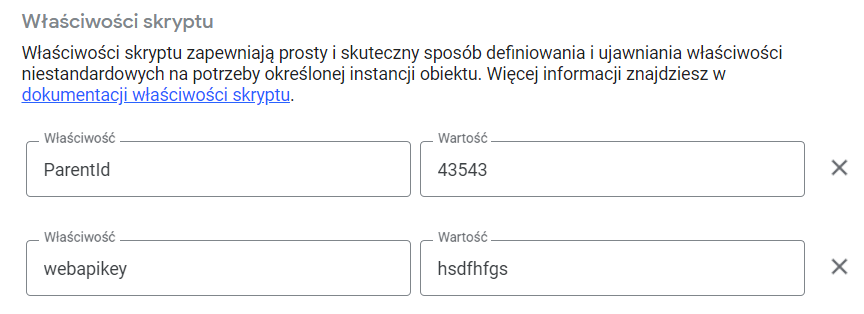
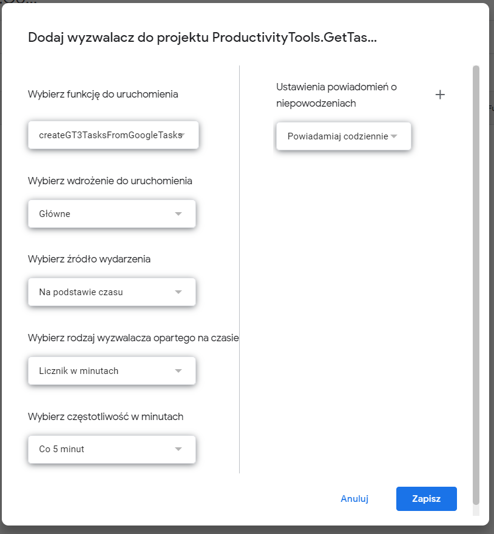
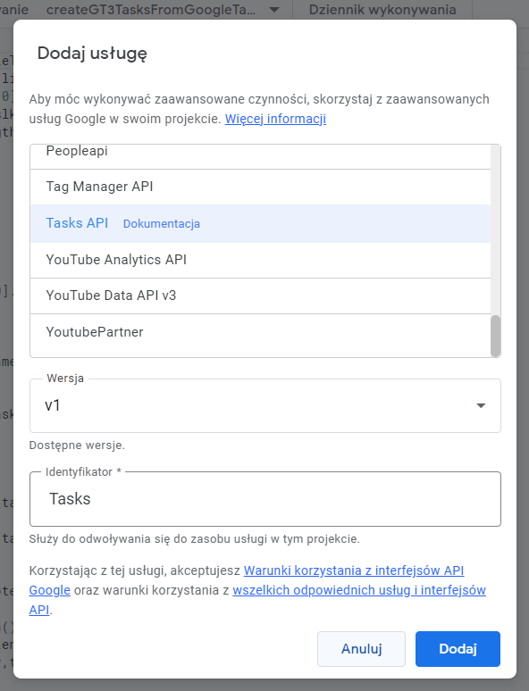

<!--Category:GAS--> 
 

    <a href="http://productivitytools.tech/"><a> 
    

    

# ProductivityTools.GetTask3.GoogleAppsScript

This is Google Apps Script which reads tasks from Google Tasks and move them to GetTask3 application.

<!--more-->

## Script properties
Script need to have two script properties:

- ParentId - which defines where new tasks will be created
- webapikey - used for authentication

## Schedule

To make the process automatic, trigger need to be added:

 

 ## Services

 Task service need to be added to be able to call API.

 