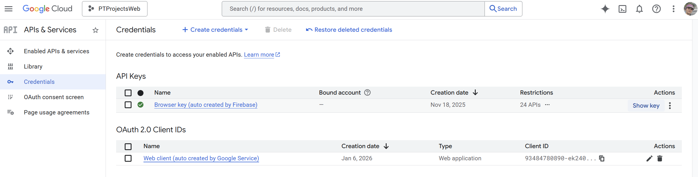
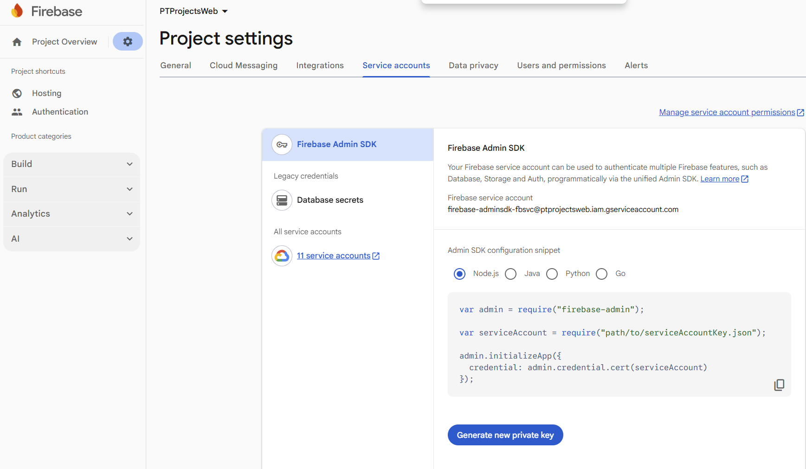

<!--Category:GAS--> 
 <p align="right">
    <a href="http://productivitytools.tech/"><a> 
    <a href="https://github.com/ProductivityTools-Tasks3/ProductivityTools.GetTask3.GoogleAppsScript"></a>
</p>
<p align="center">
    <a href="http://productivitytools.top/productivitytools-gettask3-googleappsscript/">
        
    </a>
</p>

# GetTask3 - GoogleAppsScript

This is Google Apps Script which reads tasks from Google Tasks and move them to GetTask3 application.

<!--more-->

## Script properties
Script needs to have two script properties:

- ParentId - which defines where new tasks will be created
- webapikey - used for authentication


### Webapikey

Needs to be taken from [google cloud](https://pantheon.corp.google.com/apis/credentials?authuser=2&project=ptprojectsweb)



The webapi key needs to be aligned with the service account file that is provided on the server side.

Service account key can be download in the firebase console. 



Value on the server side is used in the [startup](https://github.com/ProductivityTools-Tasks3/ProductivityTools.GetTask3.Server/blob/main/Src/Server/ProductivityTools.GetTask3.API/Startup.cs)

```
 public void ConfigureServices(IServiceCollection services)
        {
            string masterconfpath = Environment.GetEnvironmentVariable("MasterConfigurationPath");
            FirebaseApp.Create(new AppOptions()
            {
                Credential = GoogleCredential.FromFile($"{masterconfpath}\\ProductivityTools.GetTask3.ServiceAccount.json"),
            });
            services
             .AddAuthentication(JwtBearerDefaults.AuthenticationScheme)
             .AddJwtBearer(options =>
             {
                 options.Authority = "https://securetoken.google.com/ptprojectsweb";
                 options.TokenValidationParameters = new TokenValidationParameters
                 {
                     ValidateIssuer = true,
                     ValidIssuer = "https://securetoken.google.com/ptprojectsweb",
                     ValidateAudience = true,
                     ValidAudience = "ptprojectsweb",
                     ValidateLifetime = true
                 };
             });
....
```

## Schedule

To make the process automatic, trigger need to be added:

 

 ## Services

 Task service needs to be added to be able to call API.

 